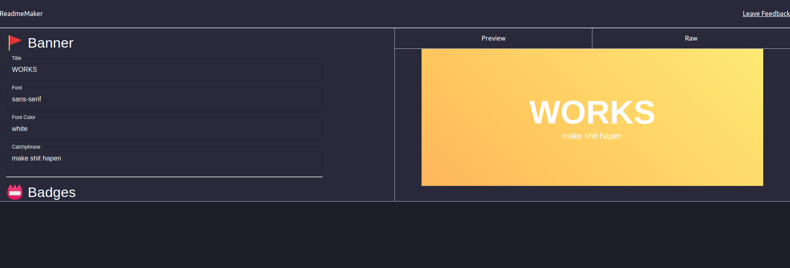

<h1 id="✨readme-maker✨">✨Readme-maker✨</h1>    
          
   <h2 id="📸-screenshots">📸 Screenshots</h2>    <h2 id="🏢-used-by">🏢 Used By</h2> <blockquote> 
Google Netflix
 </blockquote>   <h2 id="📄-documentation">📄 Documentation</h2> <blockquote> 
Does not exist!
 </blockquote>   <h2 id="⚙️-installation">⚙️ Installation</h2> <pre><code class="language-bash"># Clone this repository git clone &quot;https://www.github.com/HuzefaUsama25/Readme-maker&quot; # Change Directory cd Readme-maker # Run the app npm start </code></pre>   <h2 id="📙-usage--examples">📙 Usage / Examples</h2>   <h2 id="🛣-roadmap">🛣 Roadmap</h2>   <h2 id="🙋-related-repositories">🙋 Related Repositories</h2>   <h2 id="✍️-how-to-contribute">✍️ How to Contribute</h2>   <h2 id="🧐-faq">🧐 FAQ</h2>   <h2 id="👨💻-authors">👨‍💻 Authors</h2> 

   <h2 id="✨-feedback-how-to-give-feedback-about-the-project">✨ Feedback (How to give feedback about the project)</h2>   <h2 id="✊-support-this-project">✊ Support this project</h2>   <h2 id="📄-license">📄 License</h2>   <h2 id="📊-project-status">📊 Project status</h2>   <h2 id="😏-a-bad-joke">😏 A Bad joke!</h2> 
